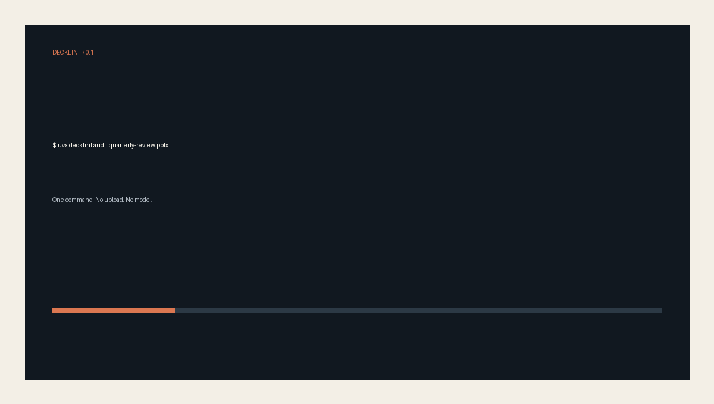

# DeckLint

> **Lighthouse for PowerPoint.** Catch broken, unreadable, flattened, inconsistent, inaccessible, and risky slides before delivery.

[](https://github.com/kdnsna/decklint/actions/workflows/ci.yml)
[](https://pypi.org/project/decklint/)
[](LICENSE)



DeckLint turns any `.pptx` into a deterministic offline HTML report and a stable JSON contract. It runs locally, does not upload your presentation, does not call an AI model, and never modifies the source file.

## Run it

```bash
uvx decklint audit quarterly-review.pptx
```

This writes `decklint-report.html` and `decklint-report.json`. Open the HTML report for page-by-page evidence; feed the JSON report to CI or an Agent.

```bash
decklint audit INPUT \
  --output decklint-report \
  --profile baseline \
  --renderer auto \
  --fail-on high
```

Exit code `0` passes, `1` means a configured quality gate failed, and `2` means the file could not be audited.

## See the proof

- [Good deck report](examples/reports/good-deck.html) — native text, readable type, no high-confidence delivery blockers.
- [Bad deck report](examples/reports/bad-deck.html) — full-slide raster, missing alt text, small type, and explicit low contrast.
- [Published JSON Schema](schema/decklint-report-v1.schema.json) — `decklint-report/v1`.

## What it checks

| Dimension | Deterministic checks |
|---|---|
| Integrity | Broken ZIP/XML, missing parts, dangling media relationships, empty decks |
| Readability | Explicit font sizes, off-canvas text, explicit low contrast, text-density hints |
| Editability | Full-slide raster coverage and native object presence |
| Consistency | Font outliers and repeated structural layout fingerprints |
| Accessibility | Missing titles, missing image alt text, reading-order risks |
| Privacy | Personal metadata, comments, hidden slides, external relationships |

High-confidence findings affect scores and gates. Low-confidence layout or density heuristics are advisory only.

## Rendering

`wireframe` renders a structural preview directly from OOXML and works everywhere. `auto` uses LibreOffice when available to render real slide previews through an isolated temporary profile, then falls back to wireframes without losing the audit.

## GitHub Action

```yaml
- uses: kdnsna/decklint@v0
  with:
    path: decks/quarterly-review.pptx
    profile: ai-generated
    fail-on: high
    min-score: "80"
```

The Action uploads both reports even when the quality gate fails.

## Scope

DeckLint v0.1 is intentionally report-only. It is not a presentation generator, visual editor, cloud service, or automatic repair tool. It does not judge whether an argument is true or whether a visual style is tasteful.

## Development

```bash
python -m venv .venv
. .venv/bin/activate
python -m pip install -e '.[dev]'
pytest
ruff check src tests tools
python -m build
```

Synthetic public fixtures live in `tests/fixtures/corpus/`; no private business presentation is committed.

## License

MIT. See [third-party notices](THIRD_PARTY_NOTICES.md).
