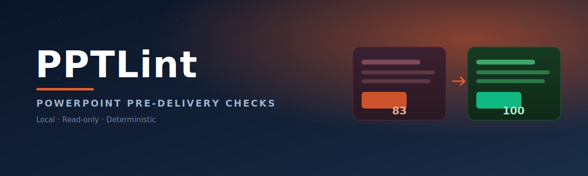

<p align="center">
  English · <a href="README.md">简体中文</a> · <a href="https://kdnsna.github.io/pptlint/">Product site</a> · <a href="https://kdnsna.github.io/pptlint/lab/">12 before/after cases</a> · <a href="https://kdnsna.github.io/pptlint/proof-loop/comparison.html">Real 83 → 100 proof</a>
</p>

<p align="center">
  
</p>

<p align="center">
  <a href="https://github.com/kdnsna/pptlint/actions/workflows/ci.yml"></a>
  <a href="https://kdnsna.github.io/pptlint/"></a>
  <a href="https://pypi.org/project/pptlint/"></a>
  <a href="LICENSE"></a>
  
</p>

<table>
  <tr>
    <td width="33%" align="center" valign="top">
      <div style="border:1px solid #ECECF1;border-radius:16px;overflow:hidden;box-shadow:0 8px 24px rgba(10,22,40,0.10);background:#ffffff;">
        <div style="background-color:#E85D2C;background:linear-gradient(135deg,#E85D2C 0%,#F2874E 100%);padding:22px 18px;text-align:center;">
          <div style="font-size:30px;line-height:1;">🏠</div>
        </div>
        <div style="padding:18px 18px 22px;">
          <h3 style="margin:0 0 8px;color:#0A1628;font-size:18px;">Product site</h3>
          <p style="margin:0 0 16px;color:#6B7280;font-size:14px;line-height:1.6;">See what PPTLint blocks before delivery, and why it never modifies the source file.</p>
          <a href="https://kdnsna.github.io/pptlint/" style="display:inline-block;padding:9px 20px;background:#E85D2C;color:#ffffff;border-radius:9px;text-decoration:none;font-weight:600;font-size:14px;">Visit →</a>
        </div>
      </div>
    </td>
    <td width="33%" align="center" valign="top">
      <div style="border:1px solid #ECECF1;border-radius:16px;overflow:hidden;box-shadow:0 8px 24px rgba(10,22,40,0.10);background:#ffffff;">
        <div style="background-color:#E85D2C;background:linear-gradient(135deg,#E85D2C 0%,#F2874E 100%);padding:22px 18px;text-align:center;">
          <div style="font-size:30px;line-height:1;">🔬</div>
        </div>
        <div style="padding:18px 18px 22px;">
          <h3 style="margin:0 0 8px;color:#0A1628;font-size:18px;">Delivery Lab</h3>
          <p style="margin:0 0 16px;color:#6B7280;font-size:14px;line-height:1.6;">12 one-glance before/after cases: projection fails, cross-machine drift, privacy leaks, editable handoff.</p>
          <a href="https://kdnsna.github.io/pptlint/lab/" style="display:inline-block;padding:9px 20px;background:#E85D2C;color:#ffffff;border-radius:9px;text-decoration:none;font-weight:600;font-size:14px;">Visit →</a>
        </div>
      </div>
    </td>
    <td width="33%" align="center" valign="top">
      <div style="border:1px solid #ECECF1;border-radius:16px;overflow:hidden;box-shadow:0 8px 24px rgba(10,22,40,0.10);background:#ffffff;">
        <div style="background-color:#E85D2C;background:linear-gradient(135deg,#E85D2C 0%,#F2874E 100%);padding:22px 18px;text-align:center;">
          <div style="font-size:30px;line-height:1;">📈</div>
        </div>
        <div style="padding:18px 18px 22px;">
          <h3 style="margin:0 0 8px;color:#0A1628;font-size:18px;">Real Proof Loop</h3>
          <p style="margin:0 0 16px;color:#6B7280;font-size:14px;line-height:1.6;">The same deck scores 83 to 100 under the current rules — before/after PPTX, reports and machine-readable data are public.</p>
          <a href="https://kdnsna.github.io/pptlint/proof-loop/comparison.html" style="display:inline-block;padding:9px 20px;background:#E85D2C;color:#ffffff;border-radius:9px;text-decoration:none;font-weight:600;font-size:14px;">Visit →</a>
        </div>
      </div>
    </td>
  </tr>
</table>

<div style="border-left:4px solid #E85D2C;background:#FFF7F2;padding:14px 18px;border-radius:0 10px 10px 0;color:#0A1628;font-size:15px;line-height:1.7;margin:26px 0;">
  <strong>Do not send the PowerPoint yet.</strong> Problems that stay invisible on your laptop often appear on your client's computer or in the meeting room.
</div>

[](https://kdnsna.github.io/pptlint/lab/)

## Not “is it beautiful?” — “is it safe to send?”

A deck can look finished and still fail at handoff:

- a substituted font wraps the title and clips the final line;
- two text boxes overlap only on another computer;
- the entire slide is one image, so a recipient cannot edit one number;
- notes, hidden slides, comments, author data, or local file links leave with the deck;
- a missing package part triggers a PowerPoint repair warning;
- duplicated media turns nine slides into an 86 MB file.

PPTLint checks locally in read-only mode and writes offline HTML and JSON reports. It **does not upload the deck, call a model, modify the source, or collect telemetry**. Only an explicitly authorized `fix` command writes a new cleanup copy.

## Start in one minute

Give this to Codex, Claude Code, or another coding agent:

```text
Install PPTLint and check whether this PowerPoint is ready to send to a client.
Separate must-fix items from human-review suggestions, name the affected slides,
and give me the exact PowerPoint steps. Do not modify the source file.
```

Or run it directly:

```bash
uvx pptlint check output.pptx --scenario present
```

Use `uvx pptlint start output.pptx` to check the deck and open the offline report. Run `uvx pptlint doctor` for a safe local diagnostic before filing an issue.

### Local drag-and-drop app

```bash
uvx --refresh pptlint app
```

The Chinese local app supports check, explicit privacy cleanup, complete Agent brief copy, repaired-copy verification, and Proof Pack export. It binds only to `127.0.0.1` on a random port, uses a fresh session token, deletes temporary files on close, and requests no external font, analytics, model, or API.

`present` is the default meeting-room scenario. Use `screen` for close screen reading or `document` for report-like decks.

Each run writes:

- `pptlint-report.html` — an offline human report that explains consequences and next steps;
- `pptlint-report.json` — stable evidence for agents, CI, and integrations.

Full reports can contain slide previews, text, and document properties. Treat them like the source deck. For external collaboration, create a redacted copy:

```bash
uvx pptlint check output.pptx --report-mode shareable --output pptlint-safe
```

## Inspect the evidence first

- [12 delivery-risk before/after cases](https://kdnsna.github.io/pptlint/lab/);
- [real editable deck: 83 → 100](https://kdnsna.github.io/pptlint/proof-loop/comparison.html), with both PPTX files and full reports;
- [before PPTX](examples/proof-loop/before.pptx) and [after PPTX](examples/proof-loop/after.pptx);
- [evaluation-method archive](https://kdnsna.github.io/pptlint/benchmark/).

In the published nine-slide Proof Loop, 103 reported items were resolved and the edited deck introduced no new high-confidence problem. **A score of 100 is a rule-check result, not an aesthetic grade or a zero-risk guarantee.**

## Three outcomes people can act on

| Result | What to do |
|---|---|
| <span style="color:#10B981;font-weight:700;">✅ Ready to send</span> | No high-confidence delivery problem was found; still perform the final human preview |
| <span style="color:#D97706;font-weight:700;">👀 Check first</span> | Open the named slides and confirm suggestions that need context or human judgment |
| <span style="color:#DC2626;font-weight:700;">⛔ Fix first</span> | Resolve the listed blocker, save a separate delivery copy, and check again |

Repeated object-level findings are grouped in HTML so 200 instances of one root cause do not become 200 noisy tasks. Full evidence remains in JSON.

## Prove the edit

Keep the original and edit a separate copy:

```bash
uvx pptlint proof before.pptx after.pptx \
  --scenario present --output comparison
```

The proof pack separates resolved, remaining, and newly introduced findings.

Create a repair brief for a coding agent:

```bash
uvx pptlint plan pptlint-report.json --format json --output repair-plan.json
uvx pptlint plan pptlint-report.json --adapter generic-agent --output repair-brief.md
uvx pptlint plan pptlint-report.json --adapter ultimate-ppt-master --output ultimate-brief.md
uvx pptlint plan pptlint-report.json --adapter powerpoint-copilot --output copilot-prompt.md
```

The plan covers every finding rather than only the first three. Each task names the location, consequence, safe repair mode, recommended executors, and verification criteria. Unknown rules always require a human decision.

### Explicit privacy cleanup copies

PPTLint can perform only three low-risk operations, and every operation must be named separately:

```bash
uvx pptlint fix input.pptx \
  --output input.delivery.pptx \
  --apply clear-personal-metadata \
  --apply remove-comments \
  --apply remove-speaker-notes
```

The source and existing outputs are never overwritten. A successful run creates a receipt, before/after reports, and comparison evidence. Hidden slides, external links, layout, type, overlap, flattened slides, and brand changes remain human or agent decisions.

## Team delivery policy

```bash
uvx pptlint policy init pptlint-policy.yml
uvx pptlint check output.pptx --policy pptlint-policy.yml
```

Policies can define approved fonts and colors, minimum type size, and rules for external links, notes, hidden slides, and alt text. Unknown policy fields fail explicitly instead of being ignored.

Document approved exceptions with a rule, optional slide scope, business reason, and expiry date. Active and expired exceptions remain visible in the report audit trail.

## Scope and boundaries

| Delivery question | What PPTLint checks |
|---|---|
| Will the file open? | PPTX package structure, relationships, content types, media, slide list, and real rendering |
| Will people see it? | Off-canvas text, substantial overlap, clipping risk, type size, contrast, and aspect ratio |
| Will it survive another computer? | Fonts, external files, motion, transitions, audio, video, and notes relationships |
| Can someone edit it? | Native text, tables, charts, shapes, and full-slide image coverage |
| Is it safe to send? | Notes, comments, hidden slides, author data, local files, and external links |
| Is handoff practical? | Package size, duplicated media, embedded fonts, and dynamic-content facts |

PPTLint does not judge aesthetics, persuasion, or factual accuracy. Low-confidence hints never block delivery. Need to create or repair the deck first? Use [Ultimate PPT Master](https://github.com/kdnsna/ultimate-ppt-master-skill), then run PPTLint as the independent check.

## GitHub Actions

```yaml
- uses: kdnsna/pptlint@v1
  with:
    path: output.pptx
    profile: ai-generated
    renderer: wireframe
```

The Action uploads redacted `shareable` reports by default. Use `report-mode: full` only in a controlled repository that needs slide previews.

Reports are uploaded even when the check fails.

## Stable interfaces and development

- Current report: [`pptlint-report/v2`](schema/pptlint-report-v2.schema.json)
- Previous report: [`decklint-report/v1`](schema/decklint-report-v1.schema.json)
- Comparison: [`decklint-comparison/v1`](schema/decklint-comparison-v1.schema.json)
- Repair plan: [`pptlint-repair-plan/v1`](schema/pptlint-repair-plan-v1.schema.json)
- Cleanup receipt: [`pptlint-repair-receipt/v1`](schema/pptlint-repair-receipt-v1.schema.json)
- Repair verification: [`pptlint-repair-verification/v1`](schema/pptlint-repair-verification-v1.schema.json)
- Verified credential: [`pptlint-verified/v1`](schema/pptlint-verified-v1.schema.json)
- Public AI-PPT compatibility: [sources and results for 33 real PPTX files](validation/README.md)
- Exit code `0`: completed; `1`: changes required; `2`: file or runtime error.

```bash
uv venv --python 3.13
uv pip install -e '.[dev]'
PYTHONPATH=src .venv/bin/python -m pytest
.venv/bin/ruff check src tests tools
```

`decklint` remains as a compatibility alias. All new documentation and commands use `pptlint`.

MIT · Local · Read-only by default · Source never modified · No upload · No model · No telemetry
